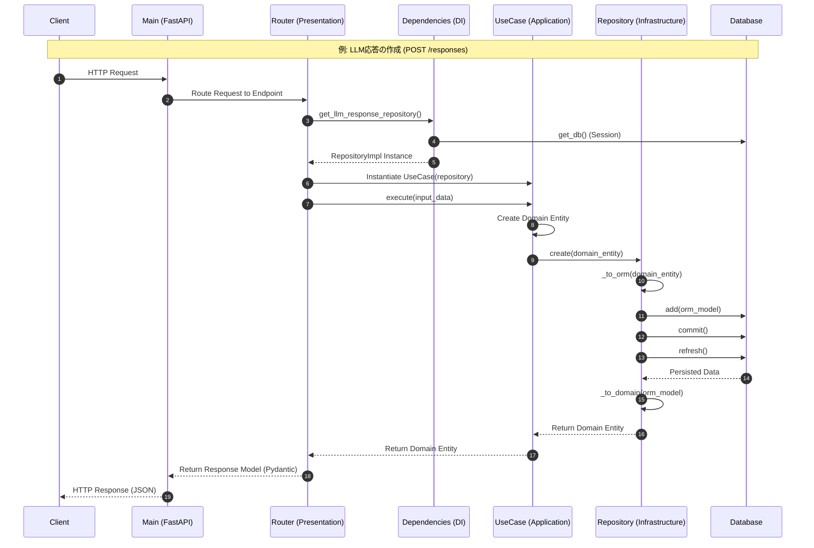

# LLMoonClip API

LLM（ChatGPT, Gemini など）の応答をカテゴリ別に管理するバックエンドAPI

## 概要

このプロジェクトは、LLMからの応答（Markdown形式）を保存・管理するためのREST APIです。ヘキサゴナルアーキテクチャ（ポート＆アダプタ）を採用し、保守性の高い設計になっています。

## 技術スタック

- **Python**: 3.13+
- **Webフレームワーク**: FastAPI
- **パッケージ管理**: uv
- **ORM**: SQLAlchemy 2.x
- **バリデーション**: Pydantic v2
- **設定管理**: pydantic-settings
- **データベース**: SQLite（開発）/ PostgreSQL対応可能
- **テスト**: pytest

## プロジェクト構成

```
LLMoonClip_API/
├── app/
│   ├── domain/              # ドメイン層（ビジネスロジック）
│   │   ├── models/          # エンティティ
│   │   ├── repositories/    # リポジトリインターフェイス
│   │   └── services/        # ドメインサービス
│   ├── application/         # アプリケーション層（ユースケース）
│   │   └── use_cases/       # 各種ユースケース
│   ├── infrastructure/      # インフラストラクチャ層（技術実装）
│   │   ├── db/              # データベース設定・モデル
│   │   ├── repositories/    # リポジトリ実装
│   │   ├── storage/         # ストレージ実装
│   │   └── di/              # 依存注入
│   ├── presentation/        # プレゼンテーション層（API）
│   │   ├── api/             # エンドポイント
│   │   └── schemas/         # Pydanticスキーマ
│   ├── config/              # 設定
│   └── main.py              # アプリケーションエントリポイント
├── tests/                   # テストコード
├── pyproject.toml           # プロジェクト設定
└── .env.example             # 環境変数テンプレート
```

## セットアップ

### 1. 依存関係のインストール

```bash
uv sync
```

### 2. 環境変数の設定

`.env.example` を `.env` にコピーして編集：

```bash
cp .env.example .env
```

### 3. アプリケーションの起動

```bash
uv run fastapi dev app/main.py
```

サーバーが `http://localhost:8000` で起動します。

## API ドキュメント

起動後、以下のURLでSwagger UIにアクセスできます：

- **Swagger UI**: http://localhost:8000/docs
- **ReDoc**: http://localhost:8000/redoc

## 主な機能

### カテゴリ管理
- カテゴリの作成・取得・更新・削除
- カテゴリ一覧の取得

### LLM応答管理
- LLM応答の作成・取得・更新・削除
- LLM応答一覧の取得
- LLM応答の検索（テキスト、カテゴリ、タグによるフィルタリング）

## アーキテクチャ

このプロジェクトは**ヘキサゴナルアーキテクチャ**を採用しています：

- **ドメイン層**: ビジネスロジックとエンティティ。フレームワークに依存しない。
- **アプリケーション層**: ユースケースの実装。ドメインモデルを組み合わせて処理を実行。
- **インフラストラクチャ層**: データベース、ストレージなどの技術的な実装。
- **プレゼンテーション層**: REST API（FastAPI）。外部とのインターフェイス。

### 依存関係のルール

- `presentation` → `application` → `domain`
- `infrastructure` → `domain`
- **ドメイン層は他の層に依存しない**

### リクエスト処理フロー

APIがリクエストを受信してからレスポンスを返すまでの詳細なフローは以下の通りです。



## 開発

### コードフォーマット

```bash
uv run ruff format app
```

### リントチェック

```bash
uv run ruff check app
```

### テスト実行

```bash
uv run pytest
```
